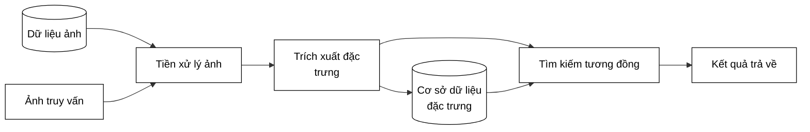

# SƠ ĐỒ KHỐI VÀ QUY TRÌNH HỆ THỐNG LEAF-CBIR

Dựa trên yêu cầu, dưới đây là 2 sơ đồ khối được mô phỏng chính xác theo cấu trúc và nội dung của mẫu hình ảnh mà bạn cung cấp.

---

## 1. Sơ đồ kiến trúc hệ thống

Sơ đồ thể hiện luồng dữ liệu hai chiều: luồng nạp dữ liệu offline (từ Dữ liệu ảnh) và luồng truy vấn online (từ Ảnh truy vấn).



---

## 2. Quy trình làm việc

Sơ đồ biểu diễn các bước thực thi tuần tự từ trên xuống dưới, mô tả chi tiết các tác vụ nhỏ bên trong mỗi giai đoạn.

```mermaid
graph TD
    subgraph Quy trình làm việc
    direction TD
        Step1[Đặt ảnh lá vào thư mục]
        
        Step2["Tiền xử lý ảnh tất cả ảnh<br>• Loại bỏ nền<br>• Phân đoạn lá<br>• Tăng cường chi tiết"]
        
        Step3["Trích xuất đặc trưng<br>• Màu sắc<br>• Hình dạng<br>• Viền<br>• Gân lá"]
        
        Step4["Tìm kiếm lá tương tự<br>• Chuẩn hoá đặc trưng<br>• Tính khoảng cách Euclidean có trọng số<br>• Xếp hạng kết quả"]

        Step1 --> Step2
        Step2 --> Step3
        Step3 --> Step4
    end

    %% Định dạng CSS cho giống khối hộp ảnh thứ 2
    style Quy trình làm việc fill:none,stroke:#000,stroke-width:2px,stroke-dasharray: 2 2
    style Step1 fill:#fff,stroke:#000,stroke-width:2px,color:#000
    style Step2 fill:#fff,stroke:#000,stroke-width:2px,color:#000,text-align:left
    style Step3 fill:#fff,stroke:#000,stroke-width:2px,color:#000,text-align:left
    style Step4 fill:#fff,stroke:#000,stroke-width:2px,color:#000,text-align:left
```
