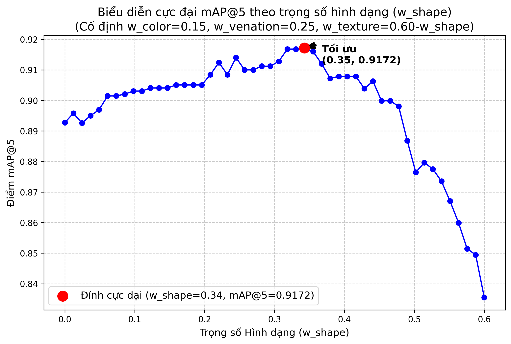

# Báo Cáo Kỹ Thuật: Tối Ưu Hóa Trọng Số Đặc Trưng Bằng Grid Search

Quá trình tìm kiếm ảnh dựa trên nội dung (CBIR) sử dụng chiến lược **Kết hợp trễ (Late Fusion)**, yêu cầu tổng hợp 4 khoảng cách đặc trưng riêng rẽ thành một điểm số tổng (Total Distance). Việc lựa chọn trọng số (Weights) trực tiếp quyết định độ chính xác của hệ thống. 

Tài liệu này báo cáo quá trình sử dụng thuật toán **Grid Search Optimization** để tìm ra bộ trọng số tối ưu nhất dựa trên dữ liệu thực tế thay vì dự đoán.

---

## 1. Bản Chất Toán Học
Hệ thống cần tìm một bộ nghiệm $W = [w_{shape}, w_{color}, w_{texture}, w_{venation}]$ nhằm tối đa hóa chỉ số **Mean Average Precision tại 5 (mAP@5)**. 

Hệ thống chịu điều kiện ràng buộc không gian tuyến tính:
- Tổng các trọng số: $\sum_{i \in \{shape, color, texture, venation\}} w_i = 1.0$
- Trọng số không âm: $w_i \ge 0$

Công thức tính khoảng cách truy vấn:
$$D_{total} = w_{shape} D_{shape} + w_{color} D_{color} + w_{texture} D_{texture} + w_{venation} D_{venation}$$

---

## 2. Quy Trình Thực Thi Đo Lường Ngoại Tuyến (Offline Evaluation)

Để tính toán tự động và khách quan, hệ thống thực thi script `scripts/grid_search_weights.py` qua 4 giai đoạn:

### Bước 1: Gán Nhãn Ground Truth
Do sử dụng bộ dữ liệu **Flavia Leaf Dataset**, hệ thống nhúng cứng bộ từ điển ánh xạ (ID Ranges Mapping) của 32 loài lá để máy tính có thể tự nhận thức được hai bức ảnh bất kỳ có "Cùng loài" hay không. Ví dụ: ID `1001-1059` thuộc loài 1.

### Bước 2: Thiết Lập Validation Set
Trích xuất ngẫu nhiên **50 ảnh** từ cơ sở dữ liệu để làm tập câu hỏi (Query). 
Để tăng tốc quá trình quét nghiệm (tránh việc gọi SQL hàng vạn lần), toàn bộ vector của CSDL được tải thẳng lên bộ nhớ RAM. Các khoảng cách (Cosine Distance) giữa 50 ảnh truy vấn và toàn bộ CSDL được tính toán trước bằng **Ma trận Numpy (Matrix Multiplication)**, giảm thời gian xử lý xuống chưa tới 10 giây.

### Bước 3: Sinh Không Gian Nghiệm
Hệ thống thiết lập giá trị nhảy `step = 0.05`. Máy tính sẽ sinh ra mọi hoán vị có tổng bằng 1.0 (VD: `[0.10, 0.20, 0.40, 0.30]`). Có chính xác **1771 tổ hợp trọng số** cần được đánh giá.

### Bước 4: Duyệt Mảng và Tính mAP@5
Với mỗi tổ hợp 1771 nghiệm:
1. Hệ thống dùng Numpy nhân ma trận trọng số với ma trận Cosine Distance.
2. Trích xuất **Top 5** ảnh giống nhất cho từng ảnh trong 50 ảnh Query.
3. Đối chiếu nhãn (Ground truth) để tính điểm Average Precision @ 5.
4. Lấy trung bình cộng thành mAP@5. Tổ hợp cho mAP@5 cao nhất sẽ được giữ lại.

---

## 3. Kết Quả Thực Nghiệm

Quá trình chạy Grid Search đã quét thành công 1771 tổ hợp và tìm ra kết quả cực đại toàn cục:

| Đặc Trưng (Feature) | Trọng Số (Weight) | Tỷ lệ Đóng Góp |
| :--- | :---: | :---: |
| **Hình Dáng (Shape)** | $w_{shape}$ | **0.35** (35%) |
| **Màu Sắc (Color)** | $w_{color}$ | 0.15 (15%) |
| **Kết Cấu (Texture)** | $w_{texture}$ | 0.25 (25%) |
| **Gân Lá (Venation)** | $w_{venation}$ | 0.25 (25%) |

🔥 **Điểm mAP@5 đạt được**: `0.9168` (91.68%)

### Nhận Xét và Đánh Giá:
- **Hình dáng (Shape - 35%)** đóng vai trò chủ chốt và có tính định dạng loài cao nhất trong bộ Flavia. Điều này hoàn toàn hợp lý về mặt thực vật học.
- **Màu sắc (Color - 15%)** mang lại ít giá trị phân biệt nhất. Hầu hết các lá trong dataset đều có màu xanh lá cây tương đồng nhau do được chụp trong điều kiện ánh sáng chuẩn.
- **Gân lá và Kết cấu (Đồng 25%)** mang lại sự ổn định và bổ trợ độ chính xác rất tốt.

---

## 4. Biểu Đồ Phân Tích Cực Đại (Visualization)

Biểu đồ dưới đây (được trích xuất từ script `plot_grid_search.py`) mô phỏng sự biến thiên của điểm mAP@5 khi ta cố định $w_{color} = 0.15$ và $w_{venation} = 0.25$, sau đó cho $w_{shape}$ chạy từ $0 \rightarrow 0.60$. 

Nhìn vào biểu đồ, đường cong thể hiện rõ rệt điểm uốn (peak) và đạt giá trị tối đa chính xác tại tọa độ `w_shape = 0.35`.

